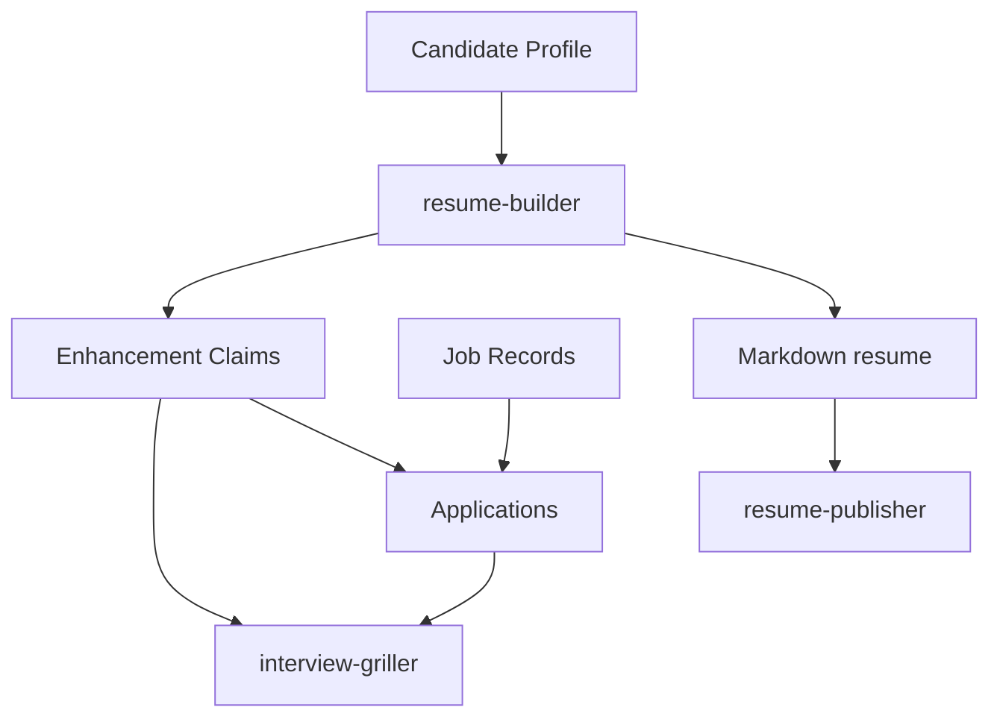

# AI Career Toolkit

一套用于自动化求职全链路的 AI Agent Skills，遵循 [agentskills.io](https://agentskills.io/specification) 规范。它以可追踪的 Career Workspace 为核心：简历增强、岗位定制、投递记录与面试训练共享同一套数据。

## 当前架构

Phase 0 + Phase 1 已建立共享契约；现有四个 Skill 仍保持兼容。后续阶段会按此契约逐个接入。



- [Current state baseline](CURRENT_STATE.md)
- [Architecture decisions](docs/decisions.md)
- [Shared schemas](schemas/README.md)
- [Runnable example workspace](examples/workspace/)

## Skills

| Skill | 功能 | 依赖 |
|-------|------|------|
| [resume-builder](./resume-builder/) | 对话式简历完善：挖掘经历、包装增强、制造技术重难点 | 无外部依赖 |
| [resume-publisher](./resume-publisher/) | 简历投递版生成：将 Markdown 简历排版导出为 DOCX | python-docx |
| [interview-griller](./interview-griller/) | 模拟面试拷打：基于简历深挖追问、实时提示、评分+学习报告 | 无外部依赖 |
| [job-hunter](./job-hunter/) | 自动化社招岗位海选：并行爬取、智能匹配、薪资风评整合 | Playwright MCP |

## 快速开始

### 1. 安装 Skills

将 skill 目录复制到你的 agent skills 目录：

```bash
git clone https://github.com/yu20120707/ai-career-toolkit.git
cp -r ai-career-toolkit/resume-builder <your-agent-skills-dir>/
cp -r ai-career-toolkit/resume-publisher <your-agent-skills-dir>/
cp -r ai-career-toolkit/interview-griller <your-agent-skills-dir>/
cp -r ai-career-toolkit/job-hunter <your-agent-skills-dir>/
```

### 2. 配置 Playwright MCP（job-hunter 需要）

在你的 agent MCP 配置文件中添加：

```json
{
  "mcpServers": {
    "playwright": {
      "command": "npx",
      "args": ["@playwright/mcp"]
    }
  }
}
```

### 3. 使用流程

```
用户 → "帮我写简历"
       → resume-builder skill 启动
       → 对话引导 → 输出 resume.md

用户 → "把简历导出成投递版 Word" + resume.md
       → resume-publisher skill 启动
       → 投递检查 → 排版生成 DOCX

用户 → "拷打我的简历" + resume.md
       → interview-griller skill 启动
       → 选模式/风格 → 逐项目追问 → 输出评分卡 + 学习报告

用户 → "帮我找工作" + resume.md
       → job-hunter skill 启动
       → 并行爬取 → 匹配分析 → 输出求职报告
```

## License

MIT
