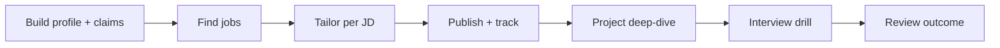

# AI Career Toolkit

一个以本地 Career Workspace 为核心的求职 Skill 工具链：从原始经历增强、岗位发现、JD 定制简历、投递版本锁定，到针对实际投递内容的面试训练与复盘。

## Five-minute workflow



1. `resume-builder` creates `candidate-profile.json` and traceable `enhancement-claims.json`.
2. `job-hunter` normalizes jobs and applies hard filters before ranking.
3. `resume-tailor` creates `tailored-resume.json` + Markdown for one JD, selecting only active claims.
4. `resume-publisher` renders the structured model to DOCX; `application-tracker` locks the submitted version.
5. `project-deep-dive` turns a project into an evidence-backed business story, optionally tied to an application.
6. `interview-griller` tests the actual JD, submitted resume, claims, deep-dive note, and prior feedback; `outcome-review` writes reusable weak points.

## Skills

| Skill | Role |
|---|---|
| `resume-builder` | Master profile + traceable enhancement claims |
| `job-hunter` | Adapter-based discovery, filtering, explainable fit score |
| `resume-tailor` | JD-specific Resume Model and claim-selection report |
| `resume-publisher` | DOCX renderer for Resume Model (Markdown compatible) |
| `application-tracker` | Immutable application artifacts and status lifecycle |
| `project-deep-dive` | Business-value project deep dive and retrospective notes |
| `interview-griller` | Submitted-resume-aware technical interview loops |
| `outcome-review` | Feedback → weak points → next-session priorities |

## Install

```bash
git clone https://github.com/yu20120707/ai-career-toolkit.git
cp -r ai-career-toolkit/{resume-builder,resume-tailor,resume-publisher,job-hunter,application-tracker,project-deep-dive,interview-griller,outcome-review} <your-agent-skills-dir>/
```

Keep real candidate workspaces outside the cloned repository or in a private directory. JSON files must conform to the contracts under [`schemas/`](schemas/README.md).

## Documentation

- [Architecture](docs/architecture.md)
- [Workflow](docs/workflow.md)
- [Enhancement policy](docs/enhancement-policy.md)
- [Current-state baseline](CURRENT_STATE.md)
- [Architecture decisions](docs/decisions.md)
- [Regression fixtures](evals/)

## Non-goals

This release does not implement a Web UI, a database service, or automatic job applications. It deliberately keeps the workflow inspectable and local-file-first.

## License

MIT
