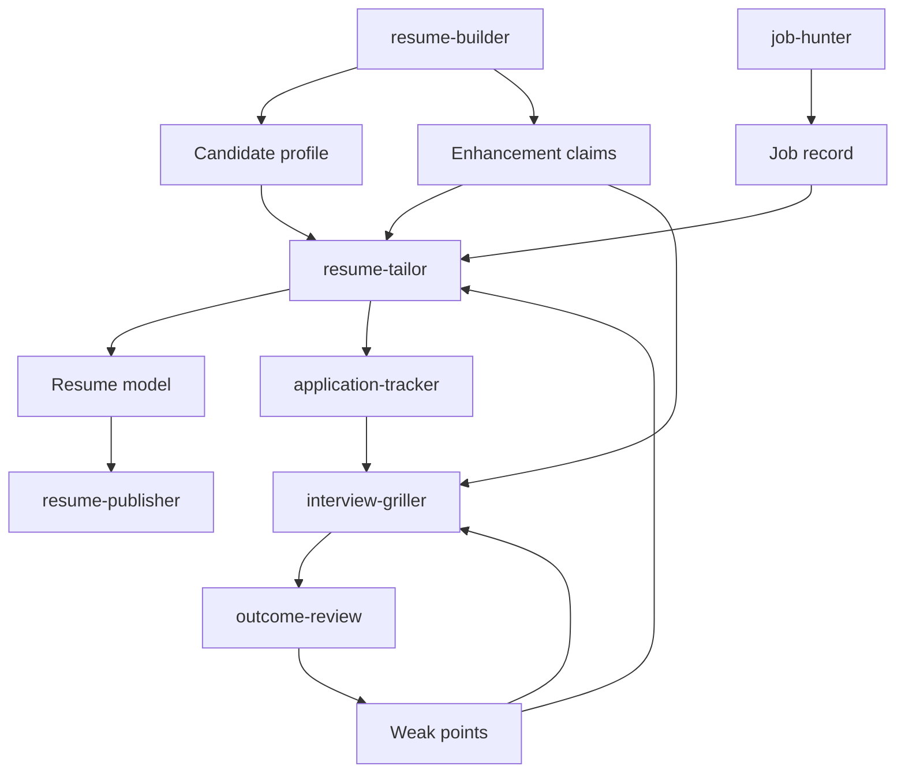

# Architecture

The toolkit is a local-file Career Workspace. JSON schemas are the authoritative hand-off; Markdown and DOCX are human-facing renderings.

## Ownership

| Artifact | Producer | Consumers | Rule |
|---|---|---|---|
| Candidate profile / claims | `resume-builder` | tailor, hunter, interview | Only builder creates new enhancements. |
| Job record | `job-hunter` | tailor, tracker | Hard filters precede ranking. |
| Resume model | `resume-tailor` | publisher, tracker, interview | Includes only active claim IDs. |
| Submitted DOCX | `resume-publisher` | tracker, interview | Immutable after application. |
| Feedback / weak points | griller, outcome review | tailor, griller | Observed feedback stays separate from inference. |

The implementation intentionally excludes UI, databases, and automated applications. A private workspace should be kept outside a public clone when it contains personal data.
