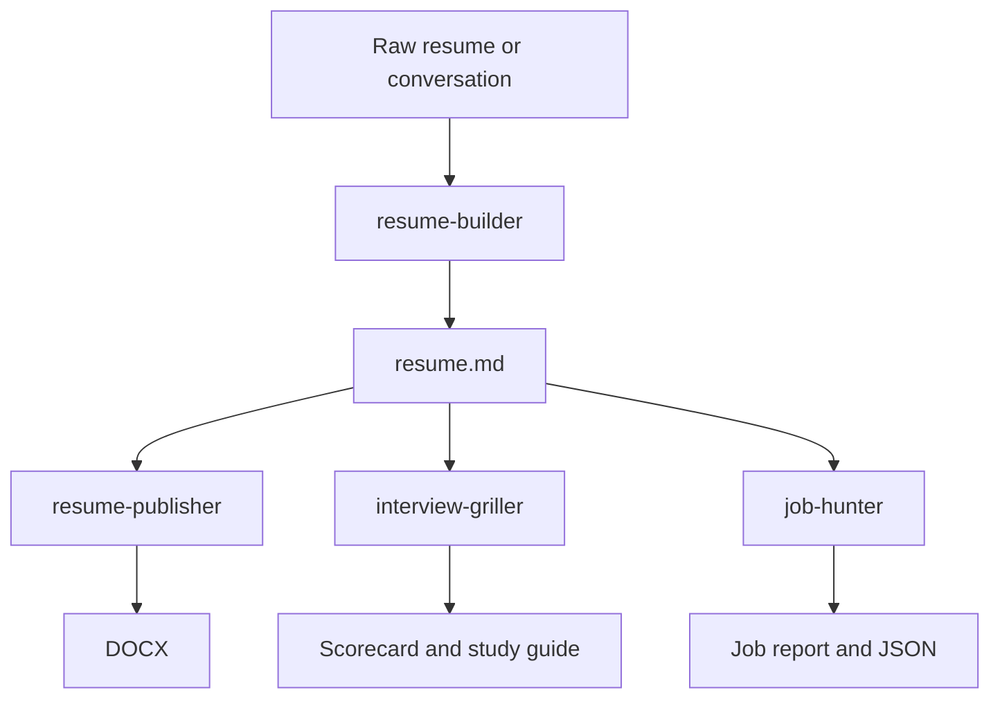

# Current Workflow (As Is)

## Data flow

## Handoffs

| From | To | Current hand-off | Limitation |
|---|---|---|---|
| `resume-builder` | all downstream skills | Markdown resume | No record of wording changes, assumptions, or interview risk. |
| `job-hunter` | user | Job report / JSON | No persistent application or submitted-resume link. |
| `interview-griller` | user | Markdown reports | Weak points do not influence the next application or interview session. |
| `resume-publisher` | user | DOCX | No machine-readable record tying the DOCX to source claims. |

## Migration rule

New capabilities write the shared Workspace in parallel with existing Markdown outputs. Markdown and DOCX remain presentation formats; the Workspace becomes the cross-skill record.
