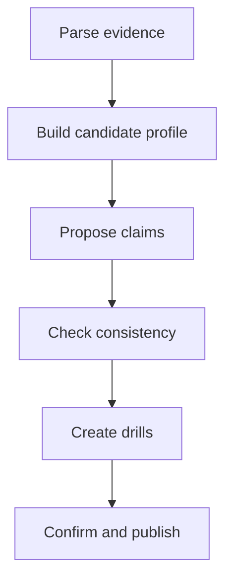

# Resume Builder — Enhancement Engine

Turn raw career evidence into a reusable, interview-defensible master profile. This Skill is the **only** source of new resume enhancements during the current workflow; `resume-publisher` renders reviewed content and must not strengthen it.

## Inputs

- A conversation, raw resume, or project notes (PDF, DOCX, Markdown, or plain text).
- Optional target role(s).
- Optional enhancement mode: `conservative`, `balanced` (default), or `aggressive`.

Treat an old resume as evidence to clarify, not as automatically current truth. Keep hard facts stable: organization/project identity, education, credentials, employment dates, and named external records must never be invented.

## Outputs

Write these files in a Career Workspace, using the paths below unless the user provides an existing workspace.

| Artifact | Path | Contract |
|---|---|---|
| Master profile | `candidate-profile.json` | Conforms to `../schemas/candidate-profile.schema.json` |
| Claim map | `enhancement-claims.json` | Conforms to `../schemas/enhancement-claim.schema.json` |
| Readable master resume | `master-resume.md` | Contains only approved `active` claims plus unenhanced facts |
| Warnings | `builder-warnings.md` | Empty is allowed; records unresolved contradictions and missing evidence |

Use stable IDs. A project ID and a claim ID must not be reused for a different entity. Do not overwrite submitted resume artifacts from later workflow stages.

## Modes

| Mode | Use | Allowed behavior |
|---|---|---|
| `conservative` | User prioritizes literal accuracy | Improve wording and structure; do not estimate metrics or add inferred technical designs without user confirmation. |
| `balanced` | Default | Make reasonable, explicitly qualified estimates and natural technical deepening from the existing stack; retain assumptions and risk. |
| `aggressive` | User explicitly wants a more competitive draft | Explore the strongest coherent role framing and challenge synthesis, but keep uncertain claims as `candidate` until approved. Never manufacture hard facts. |

All modes require the same provenance fields. Lower confidence changes must not be hidden by stronger prose.

## Workflow



### 1. Parse evidence

Split raw material into projects, roles, dates, technologies, responsibilities, outcomes, known scale, and unknowns. Ask one focused question at a time when a missing detail materially changes an important claim. Prefer questions that establish evidence: ownership, traffic/data scale, before/after behavior, failure modes, measurement source, and trade-offs.

### 2. Build the profile

Create `candidate-profile.json` first. Preserve raw responsibilities and outcomes in it rather than replacing them with polished bullets. Attach skills to project evidence through `evidence_project_ids` where possible.

### 3. Propose claims

For each high-value enhancement, create a claim with:

- `original`: user-provided wording or an approved earlier statement;
- `enhanced`: the candidate resume wording;
- `enhancement_types`: one or more contract values;
- `assumptions`: every inference and estimation basis;
- `metric`: only when a number is used, with confidence;
- `role_upgrade`: when responsibility framing changes;
- `interview_risk`, `defensibility`, `drills`, and `status`.

Allowed enhancement patterns are wording, role upgrade, technical depth, metric estimation, challenge synthesis, and adjacent skill. Derive technical depth from the project stack and context; do not transplant unrelated systems. Use ranges or qualified language such as “约” for estimates. Exact-looking numbers require a credible source.

### 4. Check consistency

Before producing a resume, check these invariants across the profile and all claims:

- project IDs, technologies, roles, and dates resolve to the profile;
- metrics use compatible scopes and units; a project does not claim conflicting throughput, latency, or ownership levels;
- a role upgrade is supported by recorded design, decision, incident, or delivery scope;
- a technical challenge is reachable from the recorded architecture;
- a skill is not presented as direct experience when its evidence is only adjacent;
- hard facts are unchanged from the supplied evidence.

Put unresolved items in `builder-warnings.md` and keep their claims as `candidate`, not `active`.

### 5. Map interview risk to drills

Assign risk based on how much the statement depends on inference, estimation, or broad ownership. `high` risk claims must have at least three concrete drills; aim for 3–8. Drill beyond definitions: measurement method, design alternatives, failure handling, trade-offs, and ownership boundaries. A user who cannot explain a claim should lower its scope, add evidence, or reject it.

### 6. Confirm and publish

Show candidate enhancements grouped by risk and ask for confirmation before switching a claim to `active`. Then generate `master-resume.md` from facts plus active claims only. Rejected ideas remain traceable as `rejected`; do not silently delete their provenance.

## Markdown Resume Shape

```markdown
# Name

## 基本信息
联系方式 | 目标岗位 | 链接

## 个人总结

## 专业技能

## 工作经历

## 项目经历
### 项目名（技术栈）
- 已确认的职责和成果
- 仅引用已激活的 Enhancement Claim

## 教育背景
```

## Boundaries

- This Skill creates the master profile and claims; `resume-tailor` will later select/reframe them for a specific JD.
- Do not claim use of a technology merely because a similar technology was used. Record it as `adjacent_skill` where relevant.
- Do not convert uncertainty into an `active` claim without candidate confirmation.
- Do not use web browsing merely to make a candidate’s private experience sound more impressive.

## Regression fixtures

Use `../evals/resume-builder/cases.json` for behavior checks. The fixtures cover metric estimation, role upgrade, stack-consistent challenge synthesis, three modes, and high-risk drill coverage.
